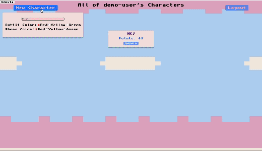

# Running Idle

**Live Link:** [Running Idle](https://running-idle.onrender.com)

## Background

Running Idle redefines the concept of a traditional workout app, transforming every run into an exhilarating journey. By seamlessly integrating Google Maps API, it turns running routes into dynamic gaming landscapes where you earn points and rewards for your real-world efforts. Create and nurture a personalized character that reflects your progress, and witness your fitness journey unfold in real-time. This app doesn't just log your runs; it gamifies them. Experience the thrill of challenges, the joy of achievements, and the tangible growth of your character as you continue to push your limits. With Running Idle, every step is a stride towards a healthier, more exciting you.

## Functionality and MVP

- **User Authentication**:
  - Users can securely sign up, sign in, and log out to safeguard their personal data and progress.
- **Character Creation (CRUD)**:
  - Create and customize a unique character, reflecting your real-world physical activity.
  - Enjoy complete control over character design and evolution, bridging the gap between the virtual and tangible.
- **Logging Runs**:
  - Track your runs, walks, and jogs with precision using location data.
  - Gain valuable insights into your fitness journey, fostering motivation and continuous progress.
- **Leaderboard**:
  - Engage in thrilling self-imposed challenges, climb the leaderboard, and unlock a multitude of achievements by upgrading your character, adding excitement to your fitness routine.
  - Every milestone achieved stands as a testament to your unwavering dedication, motivating you to explore new horizons and transform fitness into a truly rewarding endeavor.

## Application Demo

### Splash Page & Demo Login


### Character Creation & Upgrade(using cheat button)



### Demo Run


# Code Snippets

## Google Maps
We used the Google Maps React module and it's imported functions (Map, GoogleApiWrapper, Marker, and Polyline) to illustrate details about the character's current run. We placed pins on the start (currLat, currLng) and end (currLat2, currLng2) locations and used a line to connect them. Ternary logic was deployed in our JSX interpolation to render the desired current run values ONLY if endLng is 'truthy' and therefore present--otherwise return an empty string.  Time is formatted properly and distances between coordinates are calculated with helper functions.

```js
 <div id="characterrunspage-container">
  
  <div id="characterrunspage-headercontainer">
    <div id="runspage-charpagebutton">
      <button
        onClick={() => history.push(`/character/${characterId}`)}
        className="charShowButtons"
        id="charShowNavButtons"
      >
        Back
      </button>
    </div>
    <div id="characterrunspage-header">
      <div>Running Hub</div>
    </div>
    <div id="characterrunspage-characterheader">
      <div>Character: {character?.name}</div>
    </div>
  </div>
  <div id="runsdata-container">
    <div id="characterrunspage-map">
      <Map
        google={props.google}
        zoom={15}
        initialCenter={{ lat: currLat, lng: currLng }}
        style={{ width: "800px", height: "800px" }}
        center={{ lat: currLat, lng: currLng }}
      >
        <Marker
          position={{
            lat: currLat,
            lng: currLng,
          }}
          icon={markerIcon}
        />
        <Marker
          position={{
            lat: currLat2,
            lng: currLng2,
          }}
          icon={markerIcon}
        />
        <Polyline
          path={[
            { lat: currLat, lng: currLng },
            { lat: currLat2, lng: currLng2 },
          ]}
          options={{ strokeColor: "#FF0000", strokeWeight: 2 }}
        />
      </Map>
    </div>
```

## Modular CharacterItem Component

In our project, we've developed a modular CharacterItem component to maintain a clean and organized codebase. Our goal was to ensure that each file focuses on a specific aspect of our application.

### How It Works

We use this component to render CharacterItem saved files, with character data passed as props from our list of characters associated with a user. This approach offers several benefits:

1. **Organization**: The modular design helps us keep our codebase organized and easier to maintain.

2. **Rendering Character Representation**: With this code, we can render a character's representation as a saved file.

3. **Delete Functionality**: Each CharacterItem has a delete button that allows users to remove a character.

4. **Navigation**: When clicking on a rendered CharacterItem, the user is directed to the character's show page. Here, they can explore detailed information about the character within a game-like interface.

```js
router.get("/:id", async (req, res, next) => {
  try {
    const character = await Character.findById(req.params.id).populate(
      "user",
      "_id username"
    );
    return res.json(character);
  } catch (err) {
    const error = new Error("Character not found");
    error.statusCode = 404;
    error.errors = { message: "No Character found with that id" };
    return next(error);
  }
});

router.put(
  "/:id",
  requireUser,
  validateCharacterInput,
  async (req, res, next) => {
    try {
      const character = await Character.findById(req.params.id);

      if (!character) {
        const error = new Error("Character not found");
        error.statusCode = 404;
        error.message = "No Character found with that ID";
        return next(error);
      }

      character.name = req.body.name;
      character.heart = req.body.heart;
      character.legs = req.body.legs;
      character.arms = req.body.arms;
      character.outfit = req.body.outfit;
      character.shoes = req.body.shoes;
      character.points = req.body.points;

      const updatedCharacter = await character.save();
      return res.json(updatedCharacter);
    } catch (err) {
      const error = new Error("Error updating character");
      error.statusCode = 500;
      error.message = err.message;
      return next(error);
    }
  }
);
```

## Character Item

These API endpoints enable users to retrieve character details by ID and update character attributes such as name, heart, legs, arms, outfit, shoes, and points, facilitating character management and customization within the application.

```jsx
function CharacterItem({ character }) {
  const dispatch = useDispatch();

  const handleDeleteCharacter = (e) => {
    e.preventDefault();
    dispatch(deleteCharacter(character._id));
  };

  return (
    <div className="form-cont">
      <Link id="linkss" to={`/character/${character._id}`}>
        <div className="character">
          <div className="char-name">{character.name.toUpperCase()}</div>
          <div className="char-points">Points: {character.points}</div>
          <div>
            <button className="del-btn" onClick={handleDeleteCharacter}>
              Delete
            </button>
          </div>
        </div>
      </Link>
    </div>
  );
}
export default CharacterItem;
```

### Technologies Used

- MongoDB
- Express
- React
- Redux
- Node.js
- Babel
- Webpack
- Mongoose
- AWS S3
- HTML
- CSS
- Google Maps API

## Group Members and Work Breakdown

- Muhammad Amray: Frontend lead
- Avery Berry: Flex
- Alex Brown: Backend Lead
- Zi Tian Tan: Lead